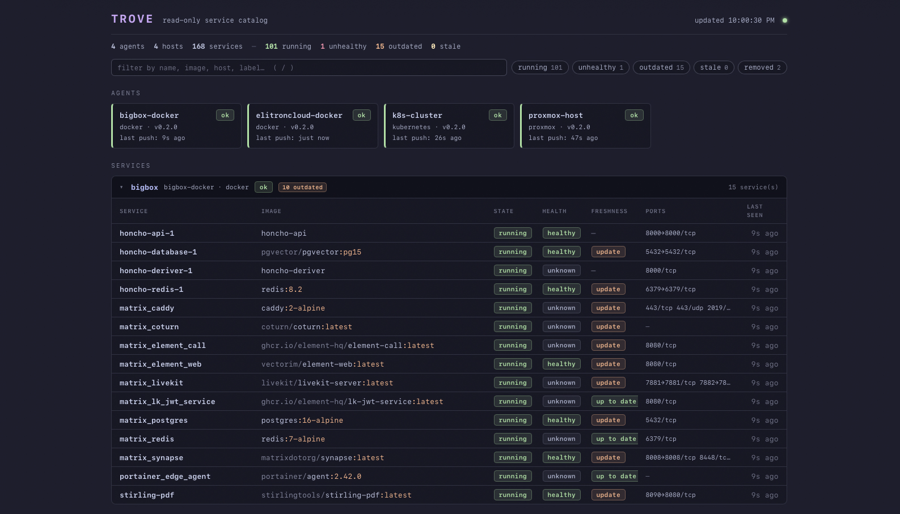

<p align="center">
  
</p>

<p align="center">
  <strong>Read-only service catalogue for Docker, Kubernetes, Proxmox, and Linux.</strong><br>
  Know what's running without giving it the keys.
</p>

<p align="center">
  <a href="https://github.com/techdox/trove/actions/workflows/ci.yml"></a>
  <a href="https://github.com/techdox/trove/releases"></a>
  <a href="https://github.com/Techdox/trove/wiki"></a>
  <a href="LICENSE"></a>
</p>

Trove is an automatically discovered, read-only inventory of everything
running in your homelab. Small agents sit next to your workloads — Docker hosts,
Kubernetes clusters, Proxmox nodes, plain Linux boxes — and push what they see
to one Trove service catalogue: what's running, where it lives, whether it's
healthy, whether its image is outdated, and whether it is still reporting.

Trove is the place to start an investigation, not the place to make a change.
It links the facts across your homelab without becoming a homepage, Grafana,
Portainer, or an infrastructure management interface.

<sub>Built by <a href="https://github.com/techdox">Techdox</a>.</sub>



*Dashboard shown with public fixture data. It contains example services only,
never a real homelab.*

**Read-only by design.** Trove can never deploy, restart, exec into, or edit
anything. There is no code path that mutates a workload — agents only ever
issue read/list calls to their platforms. This is an architectural constraint,
not a feature toggle, and it's the project's one hard rule.

## Features

- **Service catalog across platforms** — containers, K8s workloads (with pods
  nested under their Deployments), Proxmox VMs/LXCs, and systemd units, all in
  one normalized view grouped by host.
- **Health + heartbeats** — platform health where it exists (Docker
  healthchecks, K8s readiness), plus server-side staleness: an agent that goes
  quiet flags itself and all its services within ~90 seconds.
- **Host condition + resources** — reporting health stays separate from the
  platform's host condition. Proxmox and Linux hosts surface CPU, load, memory,
  disk, and uptime; local Docker agents report the kernel metrics they can
  observe truthfully; Kubernetes rolls up node readiness plus CPU/memory when
  Metrics API is available. Open the dedicated host-stats drawer from each host.
- **Image freshness** — the server checks registries (batched, cached,
  rate-limit-aware) and badges services whose running image is behind its tag.
- **Alerts & digest** — instant notifications via webhook / Discord / ntfy when
  a host stops reporting, a service goes unhealthy or dies, or an image falls
  behind — with recovery notices, flap suppression, and a scheduled email
  digest. See [docs/alerts.md](docs/alerts.md).
- **Operational dashboard** — a calm needs-attention queue first, then
  infrastructure and the full catalogue; recent changes stay available as
  history rather than competing with current problems.
- **Fast, keyboard-friendly UI** — no framework, auto-refreshing; use `/` to
  filter, `j`/`k` to move, and `enter` to open details.
- **Trivial to operate** — one static binary (or container) per role, SQLite
  storage, automatic schema migrations, push-model agents that work from
  behind NAT.

## Quickstart (5 minutes)

Trove is a **server** (the dashboard + API) plus one **agent per platform** you
want to watch. The server is the same everywhere; only the agent differs. Start
with the compose file that matches what you're watching — each one stands up the
server *and* the right agent together. Requires Docker with Compose on the
machine that will host the dashboard, and a user account that can run Docker
without `sudo`. Check that first with `docker ps`; if it reports permission
denied, follow Docker's post-install steps for your distribution and open a new
shell before continuing.

**Docker host** — server + an agent watching this box's containers:

```sh
mkdir trove && cd trove
curl -fsSLO https://raw.githubusercontent.com/techdox/trove/main/examples/docker-compose.yml

# Save the agent's token to .env — Compose loads it automatically and it
# survives restarts and upgrades. (Don't just `export` it: a new shell would
# lose it, and re-running with a fresh token silently breaks the agent.)
umask 077
echo "TROVE_TOKEN=trove_$(openssl rand -hex 24)" > .env
docker compose up -d
```

**Proxmox VE** — server + an agent watching your cluster's VMs and LXCs. First
create a read-only API token (the [Proxmox guide](docs/agents/proxmox.md) has
the exact `pveum` commands), then:

```sh
mkdir trove && cd trove
curl -fsSLO https://raw.githubusercontent.com/techdox/trove/main/examples/docker-compose.proxmox.yml

# Save settings to .env (Compose loads it automatically; it persists across
# restarts). TROVE_TOKEN is Trove's own agent token; TROVE_PROXMOX_TOKEN is
# your Proxmox API token — two different credentials.
umask 077
{
  echo "TROVE_TOKEN=trove_$(openssl rand -hex 24)"
  echo "TROVE_PROXMOX_URL=https://YOUR-PVE-HOST:8006"
  echo "TROVE_PROXMOX_TOKEN=trove@pve!trove-agent=YOUR-TOKEN-SECRET"
} > .env
chmod 600 .env
# If PVE uses its default private CA, copy /etc/pve/pve-root-ca.pem from a node
# to ./pve-root-ca.pem and uncomment the CA lines in the Compose file.
# now edit .env to fill in your real PVE host and API token, then:
docker compose -f docker-compose.proxmox.yml up -d
```

**Kubernetes** or **bare-metal Linux** — the agent doesn't run in Compose
(the K8s agent runs in-cluster as a Deployment; the bare-metal agent runs as a
systemd unit). Stand up just the server —
[`docker-compose.server.yml`](examples/docker-compose.server.yml) runs the
server with no bundled agent — then deploy the agent from the
[Kubernetes](docs/agents/kubernetes.md) or [bare-metal](docs/agents/local.md)
guide.

The compose files auto-register this first agent from `TROVE_TOKEN` (via
`TROVE_BOOTSTRAP_*`), so you don't run `agent create` for it — every
*additional* host gets its own token ([below](#adding-more-hosts-and-platforms)).

Open <http://localhost:8080>. Your services appear within ~30 seconds. First,
check **Needs attention**: a healthy first report shows a calm all-clear state;
an agent that stops reporting becomes stale and then offline. A newly registered
agent whose token has never been accepted remains `unknown`; its logs show the
server's `401` response.

If an agent does not show up, watch it connect with `docker compose logs -f
agent` (add `-f docker-compose.proxmox.yml` if you used the Proxmox file).

> ⚠️ By default, the dashboard and read APIs are open. Keep Trove on a trusted
> network (LAN/VPN/tailnet), put it behind an authenticating reverse proxy, or
> enable native OIDC. See [Dashboard authentication](docs/authentication.md).

## Adding more hosts and platforms

Each host or platform you watch runs its **own agent** — a separate process or
container, with its own image and its own token. You don't repoint an existing
agent at a new platform; you run another one. (Setting `TROVE_PROXMOX_*` on the
Docker agent, for example, does nothing — it's a different agent image; it will
connect, look healthy, and never report your Proxmox guests.)

Mint a token per agent, on the server:

```sh
# server running via Docker Compose (the quickstart):
docker compose exec server trove-server agent create <name>

# server running as a bare-metal binary — point at the SAME database the server
# uses, or the token lands in a throwaway ./trove.db and the agent can't auth
# (the systemd unit sets TROVE_DB=/var/lib/trove/trove.db):
sudo TROVE_DB=/var/lib/trove/trove.db trove-server agent create <name>
# e.g. <name> = docker-nas, k8s-homelab, proxmox
```

Then follow the guide for the platform:

| Platform                | Agent                 | Guide                                             |
| ----------------------- | --------------------- | ------------------------------------------------- |
| Docker host             | `trove-agent-docker`  | [docs/agents/docker.md](docs/agents/docker.md)    |
| Kubernetes cluster      | `trove-agent-k8s`     | [docs/agents/kubernetes.md](docs/agents/kubernetes.md) |
| Proxmox VE cluster      | `trove-agent-proxmox` | [docs/agents/proxmox.md](docs/agents/proxmox.md)  |
| Bare-metal Linux (systemd) | `trove-agent-local` | [docs/agents/local.md](docs/agents/local.md)      |

Container images (multi-arch amd64/arm64) live on GHCR:
`ghcr.io/techdox/trove-server`, `ghcr.io/techdox/trove-agent-docker`,
`ghcr.io/techdox/trove-agent-k8s`, `ghcr.io/techdox/trove-agent-proxmox`.
Static binaries for everything (including the bare-metal agent) are on the
[releases page](https://github.com/techdox/trove/releases).

## How it works

```
  docker host          k8s cluster         proxmox            nas (systemd)
 ┌────────────┐      ┌────────────┐      ┌────────────┐      ┌────────────┐
 │ agent      │      │ agent      │      │ agent      │      │ agent      │
 └─────┬──────┘      └─────┬──────┘      └─────┬──────┘      └─────┬──────┘
       │    POST /api/v1/report (Bearer token, every 30s)          │
       └───────────────┬───┴──────────────┬────────────────────────┘
                       ▼                  ▼
                  ┌─────────────────────────────┐
                  │ trove-server                │
                  │  SQLite · REST · dashboard  │
                  └─────────────────────────────┘
```

- **Agents, hosts, services**: an *agent* is one connection to the server (one
  token). It reports one or more *hosts* — a Docker host, each Proxmox node, a
  whole cluster — and each host has *services* (containers, VMs/LXCs, pods,
  systemd units). A Docker agent reports one host; one Proxmox agent reports
  every node in its cluster. On the dashboard, services are grouped by host.
- **Push model**: agents POST full-state snapshots on an interval. The server
  never reaches into your infrastructure — homelab/NAT friendly.
- **Heartbeats**: agents and hosts are tracked independently. Miss 3 intervals
  → *stale*; miss 10 → *offline*. Services follow their host's status, so one
  healthy host cannot hide another missing host from the same agent. Thresholds
  scale with each agent's own interval.
- **Full-state reports** are idempotent and tolerate lost pushes. Services
  that disappear are soft-removed and pruned after 24h (configurable,
  `TROVE_REMOVED_RETENTION`).

## Server install options

**Docker Compose** — the quickstart above; data lives in the `trove-data` volume.

**Bare metal** — download the `trove-server` archive for your arch from the
[latest release](https://github.com/techdox/trove/releases/latest) (the
`trove-server.service` unit is bundled inside it):

```sh
# pick the URL for your arch off the releases page, e.g.:
VERSION=0.15.1       # x-release-please-version; check https://github.com/techdox/trove/releases/latest for newer releases
curl -fLO "https://github.com/techdox/trove/releases/download/v${VERSION}/trove-server_${VERSION}_linux_amd64.tar.gz"
tar xzf trove-server_${VERSION}_linux_amd64.tar.gz

sudo install -m 0755 trove-server /usr/local/bin/
sudo cp deploy/systemd/trove-server.service /etc/systemd/system/
sudo systemctl enable --now trove-server
```

The server listens on `:8080` and stores its database at
`/var/lib/trove/trove.db` (the unit creates that directory via
`StateDirectory`). Mint agent tokens against that same DB — see
[Adding more hosts](#adding-more-hosts-and-platforms).

**Go install** (needs Go 1.26+):

```sh
go install github.com/techdox/trove/cmd/trove-server@latest
```

## Configuration reference

### `trove-server`

| Variable                   | Default    | Purpose                                                                |
| -------------------------- | ---------- | ---------------------------------------------------------------------- |
| `TROVE_ADDR`               | `:8080`    | Listen address.                                                         |
| `TROVE_DB`                 | `trove.db` | SQLite file path (containers default to `/data/trove.db`).             |
| `TROVE_FRESHNESS_ENABLED`  | `true`     | `false` disables image-freshness checking.                             |
| `TROVE_FRESHNESS_INTERVAL` | `5m`       | How often to scan for images due a check.                              |
| `TROVE_FRESHNESS_TTL`      | `6h`       | How long a resolved digest counts as fresh before rechecking.          |
| `TROVE_REGISTRY_AUTHS`     | _(unset)_  | Credentials for private registries — see below.                        |
| `TROVE_REGISTRY_PRIVATE_HOSTS` | _(unset)_ | Comma-separated private registry `host[:port]` allowlist. Hosts in `TROVE_REGISTRY_AUTHS` are allowed automatically. |
| `TROVE_HEALTH_DETAILS_ENABLED` | `false` | Explicitly retain and display bounded, redacted platform health messages. |
| `TROVE_EVENT_RETENTION`    | `720h` (30d) | How long events (activity feed / alert stream) are kept.             |
| `TROVE_REMOVED_RETENTION`  | `24h`      | How long removed services linger before being purged.                  |
| `TROVE_HOST_RETENTION`     | `720h` (30d) | How long a silent host and its remaining inventory are retained.     |
| `TROVE_ALERT_*` / `TROVE_SMTP_*` | _(unset)_ | Notification channels & SMTP — see [docs/alerts.md](docs/alerts.md). |
| `TROVE_DIGEST`             | `daily@08:00`* | Digest schedule; *only takes effect once `TROVE_SMTP_*` is set — see [docs/alerts.md](docs/alerts.md). |
| `TROVE_BOOTSTRAP_AGENT` / `TROVE_BOOTSTRAP_TOKEN` | _(unset)_ | Seed one agent at startup (used by the quickstart compose). |

#### Dashboard authentication (OIDC)

By default the dashboard and read APIs are open — bind to a
trusted network or front with a reverse proxy. For native authentication,
configure any OIDC-compatible provider (Authentik, Keycloak, Auth0, Google,
Dex, etc.):

| Variable | Purpose |
| --- | --- |
| `TROVE_OIDC_ISSUER` | OIDC discovery URL, e.g. `https://auth.example/application/o/trove/` |
| `TROVE_OIDC_CLIENT_ID` | OAuth2 client ID registered with your IdP |
| `TROVE_OIDC_CLIENT_SECRET` | OAuth2 client secret |
| `TROVE_OIDC_REDIRECT_URL` | Callback URL, e.g. `https://trove.example/oauth2/callback` |
| `TROVE_API_TOKEN` | _(optional)_ Random bearer token of at least 32 characters for programmatic API access (bypasses OIDC) |
| `TROVE_OIDC_SESSION_MAX_AGE` | _(optional)_ Session duration (default `8h`) |

OIDC is enabled only when all four required `TROVE_OIDC_*` settings are
present. If any required setting is present while another is missing, the
server fails startup and names the missing variables instead of leaving the
dashboard open. `TROVE_API_TOKEN` is valid only alongside a complete OIDC
configuration.

When OIDC is enabled, browser requests without a session are redirected to
your IdP's login page. After login, Trove sets a signed session cookie. API
requests with a bearer token matching `TROVE_API_TOKEN` bypass OIDC for script
access. See the safe, copyable example in
[docs/authentication.md](docs/authentication.md#programmatic-api-access).
Generate this optional token with `openssl rand -hex 32`; Trove rejects short
tokens and known documentation placeholders at startup.

Logout clears Trove's local session cookie and, when the provider exposes an
OIDC `end_session_endpoint`, redirects through provider logout so users are not
silently signed straight back in by an upstream SSO session.

Agent ingest (`POST /api/v1/report`) and `/healthz` are never gated by OIDC.

**Authentik setup:** create an OAuth2/OpenID provider with these settings:

- Redirect URI: `https://trove.example.com/oauth2/callback`
- Post-logout redirect/return URI: `https://trove.example.com/`
- Client type: Confidential
- Scopes: `openid`, `profile`, `email`

Then set the env vars:

```sh
TROVE_OIDC_ISSUER=https://auth.example.com/application/o/trove/
TROVE_OIDC_CLIENT_ID=trove
TROVE_OIDC_CLIENT_SECRET=OIDC_CLIENT_SECRET_VALUE
TROVE_OIDC_REDIRECT_URL=https://trove.example.com/oauth2/callback
```

Full setup, logout behaviour, verification commands, and troubleshooting live
in [docs/authentication.md](docs/authentication.md).

Private registry / Docker Hub credentials for freshness checks:

```sh
TROVE_REGISTRY_AUTHS='{"docker.io":{"username":"me","password":"dckr_pat_..."},"gitea.example.com":{"username":"me","password":"...","auth_realm_hosts":["sso.example.com"]}}'
```

Private IP ranges are denied by default. A host configured in
`TROVE_REGISTRY_AUTHS` is an explicit private-network allowlist entry. For an
anonymous private registry, set its exact endpoint separately, for example
`TROVE_REGISTRY_PRIVATE_HOSTS=registry.lan:5000`. Loopback, link-local/cloud
metadata, unspecified, and multicast destinations remain blocked even when
listed. Registry credentials are sent to a separate bearer-token realm only
when that realm is the registry itself, Docker Hub's standard auth service, or
an exact `auth_realm_hosts` entry. Those explicitly trusted realm hosts are
also eligible to resolve to a private address.

Docker Hub's anonymous rate limits are generous for Trove's batched, cached
checks at homelab scale, but if you run many distinct Hub images, adding a
(free) Hub account raises the ceiling.

### Agents — common to all

| Variable           | Default      | Purpose                                            |
| ------------------ | ------------ | -------------------------------------------------- |
| `TROVE_SERVER_URL` | _(required)_ | Base URL of the server.                            |
| `TROVE_TOKEN`      | _(required)_ | Bearer token from `trove-server agent create`.     |
| `TROVE_INTERVAL`   | `30s`        | Push interval (`30s`, `1m`, or bare seconds `30`). |
| `TROVE_AGENT_NAME` | hostname     | Informational; not used for the dashboard display name (see below). For the bare-metal agent specifically, it (or the OS hostname) becomes the reported host name. |

The name an agent appears under on the dashboard is the one you chose in
`trove-server agent create <name>` — not `TROVE_AGENT_NAME`. Platform-specific settings are covered in
each [agent guide](docs/agents/).

### Managing agents

Deleting an agent is an intentional server-side catalogue cleanup. It does not
stop or change anything on the infrastructure the agent used to observe.

```sh
trove-server agent create <name>    # mint a token (shown once, stored hashed)
trove-server agent list             # names, platform, status, last seen
trove-server agent delete <name>    # remove an agent and all its data
trove-server alert test             # test every configured channel + send a sample digest
```

On a Docker Compose server, run these inside the container, e.g.
`docker compose exec server trove-server agent create <name>`. On a bare-metal
server, set `TROVE_DB` to the server's database path (see
[Adding more hosts](#adding-more-hosts-and-platforms)).

## API

| Method & path           | Auth   | Purpose                                     |
| ----------------------- | ------ | ------------------------------------------- |
| `POST /api/v1/report`   | Bearer | Agent pushes a full-state report.           |
| `GET /api/v1/services`  | OIDC or optional API token | Services grouped by host (dashboard data).  |
| `GET /api/v1/agents`    | OIDC or optional API token | Agents with derived heartbeat status.       |
| `GET /api/v1/events`    | OIDC or optional API token | Recent state-change events (`?limit=&offset=&kind=&since=`). |
| `GET /api/v1/me`        | OIDC or optional API token | Current dashboard/API auth state.           |
| `GET /metrics`          | OIDC or optional API token | Prometheus text metrics.                    |
| `GET /healthz`          | none   | Database and enabled-worker health.          |

Pagination, filtering, and metrics details are in [docs/api.md](docs/api.md).

The wire contract lives in [`pkg/model`](pkg/model/model.go) — the one package
agents import. Building an agent for a new platform means implementing one
interface; see [CONTRIBUTING.md](CONTRIBUTING.md).

## Security model

- Agent ingest is authenticated with per-agent bearer tokens (256-bit random,
  stored only as SHA-256 hashes). Revoke by deleting the agent.
- **The dashboard and read APIs support optional OIDC authentication.** When
  all four required OIDC settings are set, the dashboard and all read APIs
  require a valid OIDC session. Partial configuration fails startup. When all
  authentication settings are unset, the dashboard is open — bind to a trusted
  network or front it with an authenticating reverse proxy. See
  [Dashboard authentication](#dashboard-authentication-oidc).
- Agents cannot change anything on the platforms they watch — read-only is
  enforced in code, not convention. Details in [SECURITY.md](SECURITY.md).
- Tagged binaries and container images ship with checksums, SPDX SBOMs,
  provenance, and keyless GitHub attestations. See
  [Release integrity and provenance](docs/release-security.md) for the policy
  and verification commands.

## Upgrades & backup

Upgrades are a `pull` (or binary swap) and restart away: schema migrations apply
automatically on startup and are additive. Upgrade the server first; agents from
the immediately previous release may lag while the rollout completes.
Everything is one SQLite file (`trove.db` / the `trove-data` volume) — treat it
as durable and back it up with `trove-server backup` or `sqlite3 ... ".backup"`.
It contains agent token hashes,
inventory and event history, and alert cursor/delivery state. If it is lost,
production agents must be recreated and configured with newly issued tokens
before current inventory can repopulate; event history and prior alert state
cannot be rebuilt.

See **[docs/upgrades.md](docs/upgrades.md)** for per-method upgrade steps (Docker
Compose, bare metal, `go install`, agents), version pinning, backup commands,
and how to roll back.

## Building from source

```sh
git clone https://github.com/techdox/trove.git && cd trove
make native   # all binaries for your host platform → bin/
make build    # cross-compile linux amd64+arm64
make test     # go test ./...
docker compose up --build   # contributor dev stack
```

Pure Go, no CGO, no frontend build step — the dashboard is vanilla JS embedded
into the server binary.

## Roadmap & contributing

Planned next: Helm chart, cert-expiry monitoring — see
[ROADMAP.md](ROADMAP.md) for the reasoning and sequencing. Contributions
welcome: start with [CONTRIBUTING.md](CONTRIBUTING.md).

## License

[MIT](LICENSE) © Techdox
