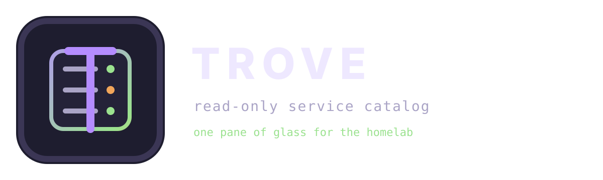
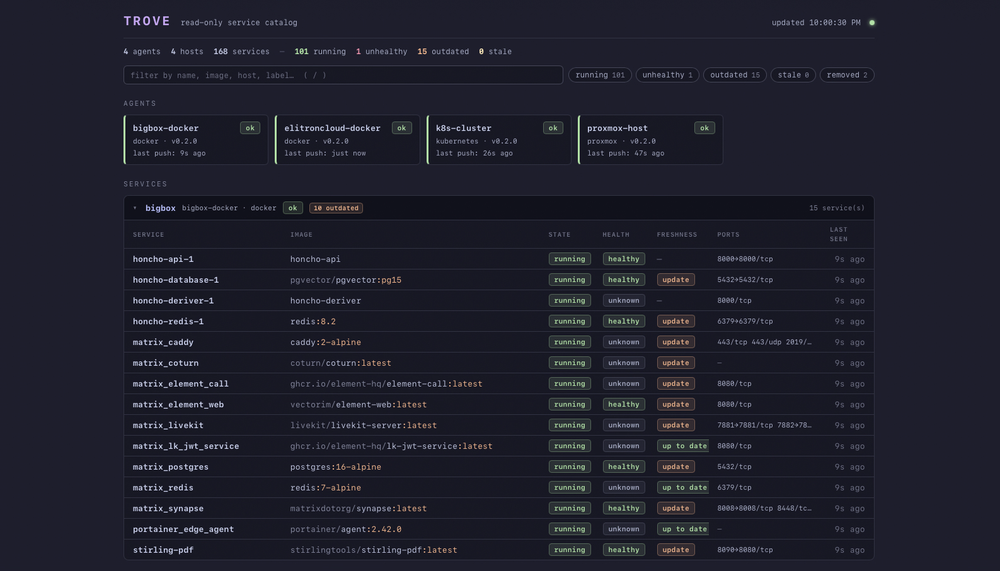

<p align="center">
  
</p>

<p align="center">
  <strong>Read-only service catalogue for Docker, Kubernetes, Proxmox, and Linux.</strong><br>
  Know what's running without giving it the keys.
</p>

<p align="center">
  <a href="https://github.com/techdox/trove/actions/workflows/ci.yml"></a>
  <a href="https://github.com/techdox/trove/releases"></a>
  <a href="https://github.com/Techdox/trove/wiki"></a>
  <a href="LICENSE"></a>
</p>

Trove is an automatically discovered, read-only inventory of everything
running in your homelab. Small agents sit next to your workloads — Docker hosts,
Kubernetes clusters, Proxmox nodes, plain Linux boxes — and push what they see
to one Trove service catalogue: what's running, where it lives, whether it's
healthy, whether its image is outdated, and whether it is still reporting.

Trove is the place to start an investigation, not the place to make a change.
It links the facts across your homelab without becoming a homepage, Grafana,
Portainer, or an infrastructure management interface.

<sub>Built by <a href="https://github.com/techdox">Techdox</a>.</sub>



*Dashboard shown with public fixture data. It contains example services only,
never a real homelab.*

**Read-only by design.** Trove can never deploy, restart, exec into, or edit
anything. There is no code path that mutates a workload — agents only ever
issue read/list calls to their platforms. This is an architectural constraint,
not a feature toggle, and it's the project's one hard rule.

## Features

- **Service catalog across platforms** — containers, K8s workloads (with pods
  nested under their Deployments), Proxmox VMs/LXCs, and systemd units, all in
  one normalized view grouped by host. Docker Compose projects and Kubernetes
  namespaces are grouped in the catalogue and can be filtered as chips.
- **Health + heartbeats** — platform health where it exists (Docker
  healthchecks, K8s readiness), plus server-side staleness: an agent that goes
  quiet flags itself and all its services within ~90 seconds.
- **Host condition + resources** — reporting health stays separate from the
  platform's host condition. Proxmox and Linux hosts surface CPU, load, memory,
  disk, and uptime; local Docker agents report the kernel metrics they can
  observe truthfully; Kubernetes rolls up node readiness plus CPU/memory when
  Metrics API is available. Open the dedicated host-stats drawer from each host.
- **Image freshness** — the server checks registries (batched, cached,
  rate-limit-aware) and badges services whose running image is behind its tag.
- **Alerts & digest** — instant notifications via webhook / Discord / ntfy when
  a host stops reporting, a service goes unhealthy or dies, or an image falls
  behind — with recovery notices, flap suppression, and a scheduled email
  digest. See [docs/alerts.md](docs/alerts.md).
- **Operational dashboard** — a calm needs-attention queue first, then
  infrastructure and the full catalogue; recent changes stay available as
  history rather than competing with current problems. Published ports and
  optional `trove.url` labels are links out to the thing you already use to
  fix it.
- **Add or remove agents from the dashboard** — mint a token and copy the
  Compose, Kubernetes, Proxmox, or systemd snippet for the next host, or
  remove an agent from the catalogue without touching the platform it watched.
- **Fast, keyboard-friendly UI** — no framework, auto-refreshing; use `/` to
  filter, `j`/`k` to move, and `enter` to open details.
- **Trivial to operate** — one static binary (or container) per role, SQLite
  storage, automatic schema migrations, push-model agents that work from
  behind NAT.

## Documentation

Use this README for installation and quickstarts. Versioned operational
guidance lives in the repository:

- [Documentation index](docs/README.md) — ownership and the complete guide map.
- [Configuration](docs/configuration.md) — every environment variable.
- [Authentication](docs/authentication.md) and [API](docs/api.md).
- [Upgrades, backup, and recovery](docs/upgrades.md).
- [Security model](SECURITY.md) and
  [release verification](docs/release-security.md).

The [wiki](https://github.com/Techdox/trove/wiki) is for discoverable
walkthroughs, screenshots, and community-oriented guides. It links back to the
repository for version-specific commands, configuration, authentication,
upgrades, and security details.

## Quickstart (5 minutes)

Trove is a **server** (the dashboard + API) plus one **agent per platform** you
want to watch. The server is the same everywhere; only the agent differs. Start
with the compose file that matches what you're watching — each one stands up the
server *and* the right agent together. Requires Docker with Compose on the
machine that will host the dashboard, and a user account that can run Docker
without `sudo`. Check that first with `docker ps`; if it reports permission
denied, follow Docker's post-install steps for your distribution and open a new
shell before continuing.

**Docker host** — server + an agent watching this box's containers:

```sh
mkdir trove && cd trove
curl -fsSLO https://raw.githubusercontent.com/techdox/trove/main/examples/docker-compose.yml

# Save the agent's token to .env — Compose loads it automatically and it
# survives restarts and upgrades. (Don't just `export` it: a new shell would
# lose it, and re-running with a fresh token silently breaks the agent.)
umask 077
echo "TROVE_TOKEN=trove_$(openssl rand -hex 24)" > .env
docker compose up -d
```

**Proxmox VE** — server + an agent watching your cluster's VMs and LXCs. First
create a read-only API token (the [Proxmox guide](docs/agents/proxmox.md) has
the exact `pveum` commands), then:

```sh
mkdir trove && cd trove
curl -fsSLO https://raw.githubusercontent.com/techdox/trove/main/examples/docker-compose.proxmox.yml

# Save settings to .env (Compose loads it automatically; it persists across
# restarts). TROVE_TOKEN is Trove's own agent token; TROVE_PROXMOX_TOKEN is
# your Proxmox API token — two different credentials.
umask 077
{
  echo "TROVE_TOKEN=trove_$(openssl rand -hex 24)"
  echo "TROVE_PROXMOX_URL=https://YOUR-PVE-HOST:8006"
  echo "TROVE_PROXMOX_TOKEN=trove@pve!trove-agent=YOUR-TOKEN-SECRET"
} > .env
chmod 600 .env
# If PVE uses its default private CA, copy /etc/pve/pve-root-ca.pem from a node
# to ./pve-root-ca.pem and uncomment the CA lines in the Compose file.
# now edit .env to fill in your real PVE host and API token, then:
docker compose -f docker-compose.proxmox.yml up -d
```

**Kubernetes** or **bare-metal Linux** — the agent doesn't run in Compose
(the K8s agent runs in-cluster as a Deployment; the bare-metal agent runs as a
systemd unit). Stand up just the server —
[`docker-compose.server.yml`](examples/docker-compose.server.yml) runs the
server with no bundled agent — then deploy the agent from the
[Kubernetes](docs/agents/kubernetes.md) or [bare-metal](docs/agents/local.md)
guide.

The compose files auto-register this first agent from `TROVE_TOKEN` (via
`TROVE_BOOTSTRAP_*`), so you don't run `agent create` for it — every
*additional* host gets its own token from the dashboard **Add agent** button
or the CLI ([below](#adding-more-hosts-and-platforms)).

Open <http://localhost:8080>. Your services appear within ~30 seconds. First,
check **Needs attention**: a healthy first report shows a calm all-clear state;
an agent that stops reporting becomes stale and then offline. A newly registered
agent whose token has never been accepted remains `unknown`; its logs show the
server's `401` response.

If an agent does not show up, watch it connect with `docker compose logs -f
agent` (add `-f docker-compose.proxmox.yml` if you used the Proxmox file).

> ⚠️ By default, the dashboard and read APIs are open. Keep Trove on a trusted
> network (LAN/VPN/tailnet), put it behind an authenticating reverse proxy, or
> enable native OIDC. See [Dashboard authentication](docs/authentication.md).

## Adding more hosts and platforms

Each host or platform you watch runs its **own agent** — a separate process or
container, with its own image and its own token. You don't repoint an existing
agent at a new platform; you run another one. (Setting `TROVE_PROXMOX_*` on the
Docker agent, for example, does nothing — it's a different agent image; it will
connect, look healthy, and never report your Proxmox guests.)

On the dashboard, click **Add agent**, pick the platform, and copy the snippet
it prints with the token already filled in. The CLI still works if you would
rather mint from the server:

```sh
# server running via Docker Compose (the quickstart):
docker compose exec server trove-server agent create <name>

# server running as a bare-metal binary — point at the SAME database the server
# uses, or the token lands in a throwaway ./trove.db and the agent can't auth
# (the systemd unit sets TROVE_DB=/var/lib/trove/trove.db):
sudo TROVE_DB=/var/lib/trove/trove.db trove-server agent create <name>
# e.g. <name> = docker-nas, k8s-homelab, proxmox
```

If an agent token is exposed or the host changes hands, rotate it with
`trove-server agent rotate <name>`. Rotation immediately invalidates the old
token, without deleting the agent or its history. Follow the platform-specific
[maintenance-window rotation guide](docs/agents/rotation.md) before running the
command.

Then follow the guide for the platform:

| Platform                | Agent                 | Guide                                             |
| ----------------------- | --------------------- | ------------------------------------------------- |
| Docker host             | `trove-agent-docker`  | [docs/agents/docker.md](docs/agents/docker.md)    |
| Kubernetes cluster      | `trove-agent-k8s`     | [docs/agents/kubernetes.md](docs/agents/kubernetes.md) |
| Proxmox VE cluster      | `trove-agent-proxmox` | [docs/agents/proxmox.md](docs/agents/proxmox.md)  |
| Bare-metal Linux (systemd) | `trove-agent-local` | [docs/agents/local.md](docs/agents/local.md)      |

Container images (multi-arch amd64/arm64) live on GHCR:
`ghcr.io/techdox/trove-server`, `ghcr.io/techdox/trove-agent-docker`,
`ghcr.io/techdox/trove-agent-k8s`, `ghcr.io/techdox/trove-agent-proxmox`.
Static binaries for everything (including the bare-metal agent) are on the
[releases page](https://github.com/techdox/trove/releases).

## How it works

```
  docker host          k8s cluster         proxmox            nas (systemd)
 ┌────────────┐      ┌────────────┐      ┌────────────┐      ┌────────────┐
 │ agent      │      │ agent      │      │ agent      │      │ agent      │
 └─────┬──────┘      └─────┬──────┘      └─────┬──────┘      └─────┬──────┘
       │    POST /api/v1/report (Bearer token, every 30s)          │
       └───────────────┬───┴──────────────┬────────────────────────┘
                       ▼                  ▼
                  ┌─────────────────────────────┐
                  │ trove-server                │
                  │  SQLite · REST · dashboard  │
                  └─────────────────────────────┘
```

- **Agents, hosts, services**: an *agent* is one connection to the server (one
  token). It reports one or more *hosts* — a Docker host, each Proxmox node, a
  whole cluster — and each host has *services* (containers, VMs/LXCs, pods,
  systemd units). A Docker agent reports one host; one Proxmox agent reports
  every node in its cluster. On the dashboard, services are grouped by host.
- **Push model**: agents POST full-state snapshots on an interval. The server
  never reaches into your infrastructure — homelab/NAT friendly.
- **Heartbeats**: agents and hosts are tracked independently. Miss 3 intervals
  → *stale*; miss 10 → *offline*. Services follow their host's status, so one
  healthy host cannot hide another missing host from the same agent. Thresholds
  scale with each agent's own interval.
- **Full-state reports** are idempotent and tolerate lost pushes. Services
  that disappear are soft-removed and pruned after 24h (configurable,
  `TROVE_REMOVED_RETENTION`).

## Server install options

**Docker Compose** — the quickstart above; data lives in the `trove-data` volume.

**Bare metal** — download the `trove-server` archive for your arch from the
[latest release](https://github.com/techdox/trove/releases/latest) (the
`trove-server.service` unit is bundled inside it):

```sh
# pick the URL for your arch off the releases page, e.g.:
VERSION=0.18.0       # x-release-please-version; check https://github.com/techdox/trove/releases/latest for newer releases
curl -fLO "https://github.com/techdox/trove/releases/download/v${VERSION}/trove-server_${VERSION}_linux_amd64.tar.gz"
tar xzf trove-server_${VERSION}_linux_amd64.tar.gz

sudo install -m 0755 trove-server /usr/local/bin/
sudo cp deploy/systemd/trove-server.service /etc/systemd/system/
sudo systemctl enable --now trove-server
```

The server listens on `:8080` and stores its database at
`/var/lib/trove/trove.db` (the unit creates that directory via
`StateDirectory`). Mint agent tokens against that same DB — see
[Adding more hosts](#adding-more-hosts-and-platforms).

**Go install** (needs Go 1.26+):

```sh
go install github.com/techdox/trove/cmd/trove-server@latest
```

## Configuration reference

Every environment variable lives in
[docs/configuration.md](docs/configuration.md). That includes server settings,
agent settings, registry credentials, retention, alerts, and OIDC.

#### Dashboard authentication (OIDC)

The dashboard is open unless you put it behind a reverse proxy or enable
native OIDC. The reverse-proxy path is the usual homelab setup; OIDC is
optional if you already have an identity provider. See
[Dashboard authentication](docs/authentication.md). Agent ingest
(`POST /api/v1/report`) and `/healthz` remain reachable without dashboard
auth.

## API

| Method & path           | Auth   | Purpose                                     |
| ----------------------- | ------ | ------------------------------------------- |
| `POST /api/v1/report`   | Bearer | Agent pushes a full-state report.           |
| `POST /api/v1/agents`   | OIDC or optional API token | Mint an agent token and return an install snippet. |
| `DELETE /api/v1/agents/{name}` | OIDC or optional API token | Remove an agent and its catalogue data. |
| `GET /api/v1/services`  | OIDC or optional API token | Services grouped by host (dashboard data).  |
| `GET /api/v1/agents`    | OIDC or optional API token | Agents with derived heartbeat status.       |
| `GET /api/v1/events`    | OIDC or optional API token | Recent state-change events (`?limit=&offset=&kind=&since=`). |
| `GET /api/v1/me`        | OIDC or optional API token | Current dashboard/API auth state.           |
| `GET /metrics`          | OIDC or optional API token | Prometheus text metrics.                    |
| `GET /healthz`          | none   | Database and enabled-worker health.          |

Pagination, filtering, and metrics details are in [docs/api.md](docs/api.md).

The wire contract lives in [`pkg/model`](pkg/model/model.go) — the one package
agents import. Building an agent for a new platform means implementing one
interface; see [CONTRIBUTING.md](CONTRIBUTING.md).

## Security model

- Agent ingest is authenticated with per-agent bearer tokens (256-bit random,
  stored only as SHA-256 hashes). Revoke by deleting the agent.
- **The dashboard and APIs support optional authentication.** When all
  authentication settings are unset, the dashboard is open — bind to a trusted
  network or front it with an authenticating reverse proxy. Native OIDC is
  optional. See [Dashboard authentication](docs/authentication.md).
  `POST /api/v1/agents` and `DELETE /api/v1/agents/{name}` use that same
  dashboard auth; they never mutate a monitored platform.
- Agents cannot change anything on the platforms they watch — read-only is
  enforced in code, not convention. Details in [SECURITY.md](SECURITY.md).
- Tagged binaries and container images ship with checksums, SPDX SBOMs,
  provenance, and keyless GitHub attestations. See
  [Release integrity and provenance](docs/release-security.md) for the policy
  and verification commands.

## Upgrades & backup

Schema migrations are automatic and additive, but the SQLite database is
durable state and a verified backup is the rollback path. Upgrade the server
before its agents.

The canonical procedure is [docs/upgrades.md](docs/upgrades.md): it owns the
Compose, systemd, and `go install` commands; `trove-server doctor`; backup
creation and read-only verification; retention examples; restore rehearsal;
and rollback.

## Building from source

```sh
git clone https://github.com/techdox/trove.git && cd trove
make native   # all binaries for your host platform → bin/
make build    # cross-compile linux amd64+arm64
make test     # go test ./...
docker compose up --build   # contributor dev stack
```

Pure Go, no CGO, no frontend build step — the dashboard is vanilla JS embedded
into the server binary.

## Roadmap & contributing

Current focus: operator confidence and the stability contract on the path to
`v1.0.0`. Helm packaging and certificate-expiry monitoring remain post-1.0 —
see [ROADMAP.md](ROADMAP.md) for the gates and sequencing. Contributions
welcome: start with [CONTRIBUTING.md](CONTRIBUTING.md).

## License

[MIT](LICENSE) © Techdox
